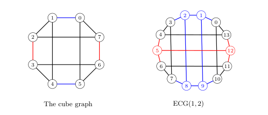

# graph-parameters
A variety of parameters for graph families

- [Aztex Diamond](#aztex-diamond)
- [Extended](#extended-cube)

# Aztex Diamond

 - Definition:
 - Notation:
 - $Z(G)$: $r$

# Extended Cube

 - Definition:
 - Notation:
