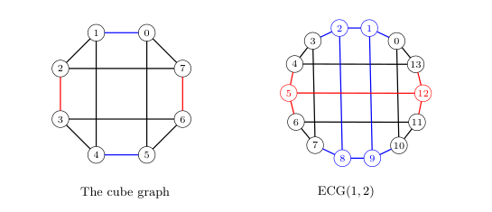

# Extended Cube

 - Definition: An extended cube graph is the cube graph with a horizontal
	 \(t-\)subdivision edge insertion and a vertical \(k-\)subdivision edge
	 insertion. [Definition 3.8](https://mathscinet.ams.org/
 - Notation: \( ECG(t,k) \)
 - Zero Forcing Number: \( 4 \) [Corollary 3.11](https://mathscinet.ams.org/mathscinet-getitem?mr=4024242)
 - Maximum Nullity: \( 4 \) [Corollary 3.11](https://mathscinet.ams.org/mathscinet-getitem?mr=4024242)
 - Minimum Rank: \( n-4 \)
 - Minimum Degree: \( 3 \)
